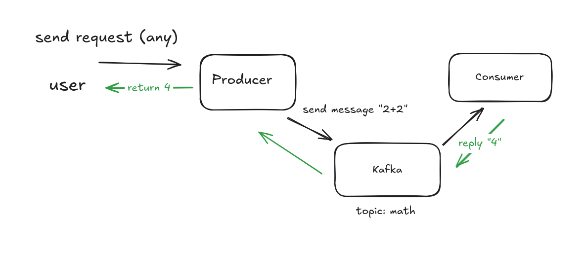

# Kafka Flow - Request-Reply Math Calculator

A microservices demonstration using Apache Kafka for asynchronous request-reply pattern.

## Architecture



**Flow:**
1. User sends a math expression (e.g., "2+2") to the Producer service
2. Producer sends the expression to Kafka topic `math-requests`
3. Consumer listens to `math-requests`, calculates the result
4. Consumer sends the result back via Kafka topic `math-replies`
5. Producer receives the reply and returns it to the User

## Services

| Service | Port | Description |
|---------|------|-------------|
| Kafka | 19092 (external), 9094 (internal) | Apache Kafka message broker |
| Kafka UI | 8888 | Web UI for Kafka monitoring |
| Producer | 8080 | Accepts user requests, sends to Kafka |
| Consumer | 8081 | Processes math expressions, sends replies |

## Quick Start

### Start all services

```bash
docker-compose up --build
```

### Wait for services to be healthy (about 60 seconds)

```bash
docker-compose ps
```

### Test the math calculation

```bash
# Simple calculation
curl -X POST "http://localhost:8080/api/kafka/calculate?expression=2+2"

# Response: {"expression":"2+2","result":"4","status":"SUCCESS"}
```

## API Endpoints

### Producer Service (port 8080)

#### Calculate (Synchronous)
Sends expression and waits for result.

```bash
# Query parameter
POST http://localhost:8080/api/kafka/calculate?expression=2+2

# JSON body
POST http://localhost:8080/api/kafka/calculate-json
Content-Type: application/json
{"expression": "10*5+3"}
```

#### Calculate (Asynchronous)
Fire-and-forget mode, returns correlationId.

```bash
POST http://localhost:8080/api/kafka/calculate-async?expression=100/4
```

#### Other endpoints
```bash
# Health check
GET http://localhost:8080/api/kafka/health

# List topics
GET http://localhost:8080/api/kafka/topics

# Read messages from a topic
GET http://localhost:8080/api/kafka/messages/math-requests?max=10
```

### Consumer Service (port 8081)

```bash
# Health check
GET http://localhost:8081/api/health
```

## Supported Math Operations

- Addition: `2+3` → `5`
- Subtraction: `10-4` → `6`
- Multiplication: `5*6` → `30`
- Division: `20/4` → `5`
- Parentheses: `(2+3)*4` → `20`
- Decimals: `3.14*2` → `6.28`
- Complex: `((10+5)*2)/3` → `10`

## Example Requests

```bash
# Basic arithmetic
curl -X POST "http://localhost:8080/api/kafka/calculate?expression=2%2B2"
# Note: + must be URL encoded as %2B

# Complex expression
curl -X POST "http://localhost:8080/api/kafka/calculate?expression=(10%2B5)*2"

# JSON format (no URL encoding needed)
curl -X POST "http://localhost:8080/api/kafka/calculate-json" \
  -H "Content-Type: application/json" \
  -d '{"expression": "100/4+25"}'
```

## Monitoring

Access Kafka UI at http://localhost:8888 to:
- View topics (`math-requests`, `math-replies`)
- Browse messages
- Monitor consumer groups

## Stop Services

```bash
docker-compose down

# To also remove volumes (clears Kafka data)
docker-compose down -v
```

## Development

### Build without Docker

```bash
# Producer
cd kafka-producer
mvn clean package

# Consumer
cd kafka-consumer
mvn clean package
```

### Run locally (requires Kafka running)

```bash
# Start only Kafka
docker-compose up kafka-1 kafka-ui

# Run producer (in kafka-producer directory)
mvn spring-boot:run

# Run consumer (in kafka-consumer directory)
mvn spring-boot:run
```

Note: When running locally, update `application.properties` to use `localhost:19092` instead of `kafka-1:9094`.

